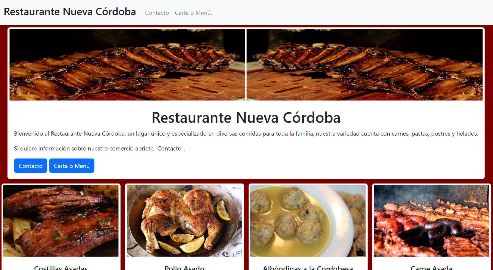
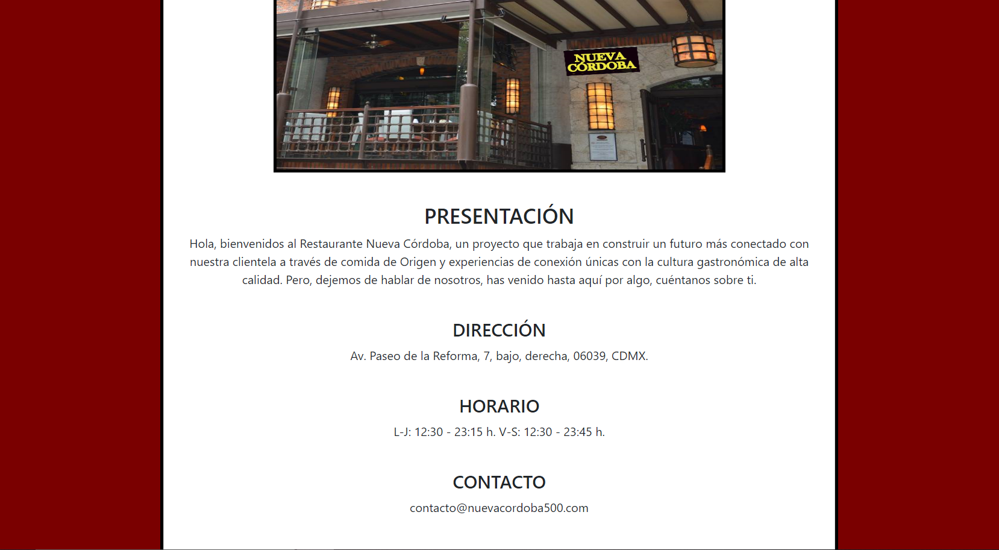
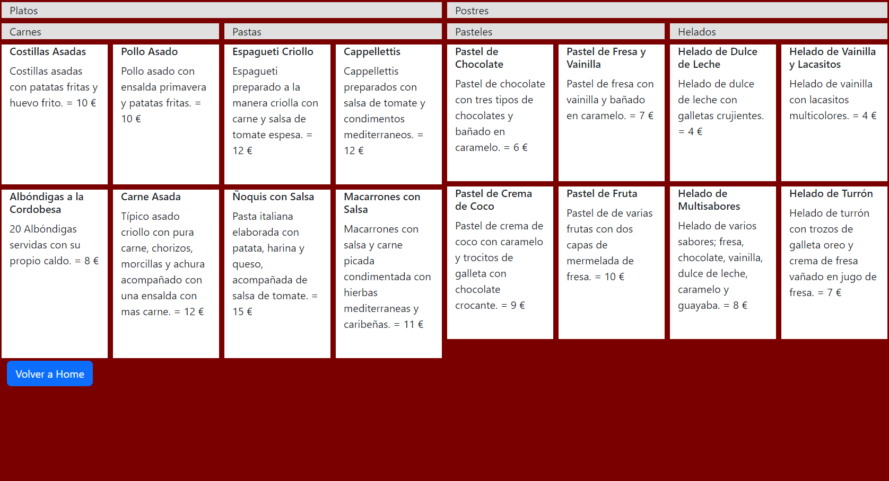

Proyecto 2 - Carta Restaurante Digital

En este proyecto se ha realizado una pagina web para un restaurante,  en la cual tienen que aparecer todas la características básicas para esta clase de paginas.

A continuación un link a un demo con el proyecto desplegado.
file:///C:/Users/PC100/Desktop/Bootstraprestaurante-master/index.html

Para este proyecto se han utilizado los programas HTML Y CSS además del Bootstrap.

Conclución
Este proyecto ha sido bastante tedioso debido a la cantidad de códigos que había que anexar entre html y css. Además de que había que encontrar el sentido de los códigos de Bootstrap.

A continuación tres imágenes de muestra de como se tendría que ver la pagina.

